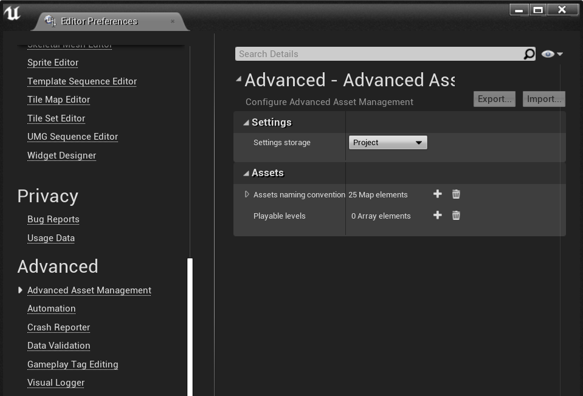
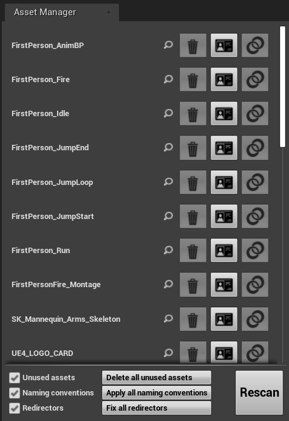

# Advanced Asset Management for Unreal Engine

A plugin for Unreal Engine to help developers organize and manage their assets. Enforcing naming conventions, fixing redirectors and removing unused assets can all be done with a single click.

## Installation
1. Copy the `AssetManagement` folder from `Plugins` to one of the following location:
* `[Project root]\Plugins\AssetManagement`
* `[Unreal engine location]\Engine\Plugins\Marketplace\AssetManagement`
2. Open a project in Unreal Engine
3. Navigate to `Edit > Plugins > Developer`
4. Enable the `Advanced Asset Management` plugin
5. Restart the editor

## Usage

### Settings
You can change the plugin settings at `Edit > Editor Preferences > Advanced > Advanced Asset actions`

The settings can be stored in different locations:
* *Project*: Settings will be stored in the project config and get shared with other developers
* *Per user*: Settings are unique for every developer

### Asset Management
Most actions are handled through the same panel. It can be opened here: `Asset Tools > Asset Manager`

This window shows a list of assets which have one or more pending actions. These actions can be performed by pressing the related button next to the asset.
